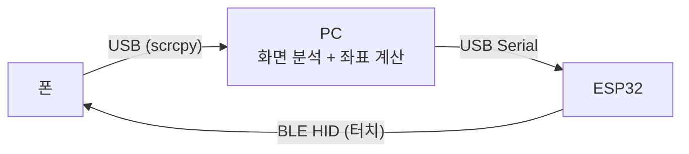

# 제어 파이프라인

- 폰 화면을 PC가 받아 분석하고, 계산한 좌표를 별도의 BLE 터치 장치를 거쳐 폰에 입력한다.
  - 입력 경로가 화면 경로와 분리되어 있다.
  - 폰에서 화면을 내보내는 것과 터치를 받는 것이 서로 다른 장치다.

## 구성 요소

| 구성 요소 | 역할                                                | 위치                          |
| --------- | --------------------------------------------------- | ----------------------------- |
| 폰        | 게임을 실행하고, scrcpy 서버로 화면을 내보낸다      | 안드로이드 기기               |
| PC        | 프레임을 분석해 다음에 누를 좌표를 정한다           | 이 리포지토리의 Python 패키지 |
| ESP32     | 시리얼로 받은 좌표를 BLE HID 터치 리포트로 변환한다 | 미정                          |
