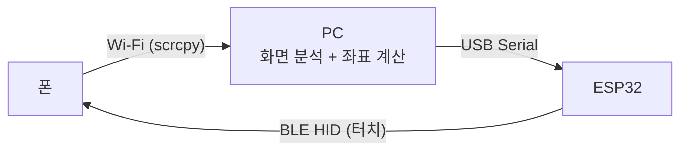
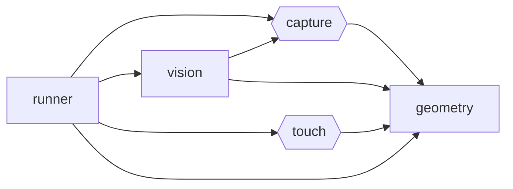

# 제어 파이프라인

폰 화면을 PC가 받아 분석하고, 계산한 좌표를 별도의 BLE 터치 장치를 거쳐 폰에 입력한다.
입력 경로가 화면 경로와 분리되어 있어 폰에서 보면 화면을 내보내는 것과 터치를 받는 것이
서로 다른 장치다.

## 구성 요소

| 구성 요소 | 역할                                                | 위치                          |
| --------- | --------------------------------------------------- | ----------------------------- |
| 폰        | 게임을 실행하고, scrcpy 서버로 화면을 내보낸다      | 안드로이드 기기               |
| PC        | 프레임을 분석해 다음에 누를 좌표를 정한다           | 이 리포지토리의 Python 패키지 |
| ESP32     | 시리얼로 받은 좌표를 BLE HID 터치 리포트로 변환한다 | 별도 리포지토리 (펌웨어)      |

## 모듈 구조

Python 패키지 `android_auto_control`은 파이프라인의 세 구간을 그대로 모듈로 나눈다.

| 모듈       | 입력          | 출력                | 하는 일                                      |
| ---------- | ------------- | ------------------- | -------------------------------------------- |
| `capture`  | scrcpy 스트림 | 프레임 (numpy 배열) | 폰 화면을 받아 한 장씩 넘긴다                |
| `vision`   | 프레임        | 프레임 좌표         | 프레임에서 찾는 대상의 위치를 낸다           |
| `touch`    | 폰 화면 좌표  | 시리얼 명령         | 좌표를 ESP32가 읽는 명령으로 만들어 보낸다   |
| `geometry` | 프레임 좌표   | 폰 화면 좌표        | 좌표계 사이를 변환한다                       |
| `runner`   | -             | -                   | 위 모듈을 이어 붙여 한 번의 판단 주기를 돈다 |

모듈 사이의 의존은 한 방향으로만 흐른다.

- **화살표 `A → B`는 A가 B를 import한다는 뜻이다.** 거슬러 올라가면 하나를 고칠 때 누가
  영향받는지가 보인다.
- **육각형은 외부 장치를 감싸는 모듈이고 사각형은 순수 계산이다.** `capture`는 폰을,
  `touch`는 ESP32를 맡는다. `vision`과 `geometry`는 외부 의존이 없어 값만 넣으면 테스트된다.
- **`runner`를 의존하는 모듈은 없다.** 다섯을 모두 아는 유일한 자리이므로 판단 주기가 바뀌면
  여기만 고친다.
- **`__main__`은 그래프 밖에서 명령줄 인자를 받아 `touch`를 부른다.** 파이프라인의 일부가
  아니라 사람이 손으로 입력 경로를 확인하는 통로다.

## 좌표계

세 좌표계를 거치며, 변환은 `geometry`가 전담한다.

| 좌표계          | 범위            | 쓰이는 곳           |
| --------------- | --------------- | ------------------- |
| 프레임 픽셀     | `0..frame_w-1`  | `capture`, `vision` |
| 폰 화면 픽셀    | `0..screen_w-1` | `touch`의 입력      |
| HID 정규화 좌표 | `0..32767`      | ESP32 → 폰          |

scrcpy는 화면을 축소해 보낼 수 있으므로 프레임 크기와 폰 화면 크기가 다르다. 프레임 좌표에
`screen_w / frame_w`를 곱해 폰 화면 좌표를 얻고, HID 정규화는 ESP32가 맡는다.

## 시리얼 프로토콜

PC가 ESP32에 보내는 단방향 텍스트 프로토콜이다. 한 줄이 한 명령이고 `\n`으로 끝난다.
좌표는 폰 화면 픽셀, 시간은 밀리초 단위의 정수다.

| 명령             | 뜻                                    |
| ---------------- | ------------------------------------- |
| `T <x> <y> <ms>` | `(x, y)`를 `ms` 동안 누르고 뗀다      |
| `D <x> <y>`      | `(x, y)`를 누른 채로 둔다             |
| `M <x> <y>`      | 누른 상태에서 `(x, y)`로 옮긴다       |
| `U`              | 뗀다                                  |
| `S <w> <h>`      | 폰 화면 크기를 알린다 (연결 직후 1회) |

ESP32는 명령마다 `OK` 또는 `ERR <사유>`를 한 줄로 돌려준다.
