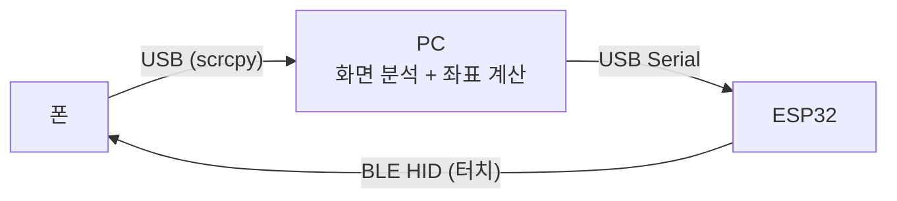

# 제어 파이프라인

- 폰 화면을 PC가 받아 분석하고, 계산한 좌표를 별도의 BLE 터치 장치를 거쳐 폰에 입력한다.
  - 입력 경로가 화면 경로와 분리되어 있다.
  - 폰에서 화면을 내보내는 것과 터치를 받는 것이 서로 다른 장치다.

## 구성 요소

| 구성 요소 | 역할                                                | 위치                          |
| --------- | --------------------------------------------------- | ----------------------------- |
| 폰        | 게임을 실행하고, scrcpy 서버로 화면을 내보낸다      | 안드로이드 기기               |
| PC        | 프레임을 분석해 다음에 누를 좌표를 정한다           | 이 리포지토리의 Python 패키지 |
| ESP32     | 시리얼로 받은 좌표를 BLE HID 터치 리포트로 변환한다 | 미정                          |

## 화면 수신

폰 화면은 scrcpy 서버를 통해 USB adb로 받는다. `scrcpy.exe` 창을 띄우는 대신, PC가 scrcpy
서버를 직접 구동하고 영상 소켓을 읽어 프레임을 numpy 배열로 만든다.

| 단계      | 하는 일                                                                       | 쓰는 것       |
| --------- | ----------------------------------------------------------------------------- | ------------- |
| 서버 배포 | scrcpy 서버를 `/data/local/tmp`에 올리고 `app_process`로 영상 전용으로 띄운다 | adbutils      |
| 소켓 연결 | USB adb 터널로 영상 소켓을 열어 코덱 메타와 H.264 패킷을 받는다               | adbutils      |
| 디코딩    | H.264 패킷을 BGR 프레임(numpy)으로 푼다                                       | av (PyAV)     |
| 미리보기  | 프레임을 OpenCV 창에 띄우고 `q`로 닫는다                                      | opencv-python |

- `capture`는 위 단계를 감싸 BGR 프레임을 내보내는 모듈이다. 외부 장치인 폰을 감싸는 자리다.
- 영상만 받는다. 오디오와 컨트롤 소켓은 열지 않는다.
- scrcpy 서버 바이너리는 설치된 scrcpy와 버전이 같아야 하고(현재 3.3.4), 클라이언트는 같은
  버전 문자열을 넘겨 서버를 구동한다. 서버 경로는 설정으로 받으며, 기본값은 PATH의 `scrcpy`
  옆에 있는 `scrcpy-server`다.
- 미리보기는 앱 실행(`make run`)의 기본 동작으로 붙인다.
- 이 구간은 화면을 창에 띄우는 데까지다. 좌표 변환과 터치 입력은 포함하지 않는다.
